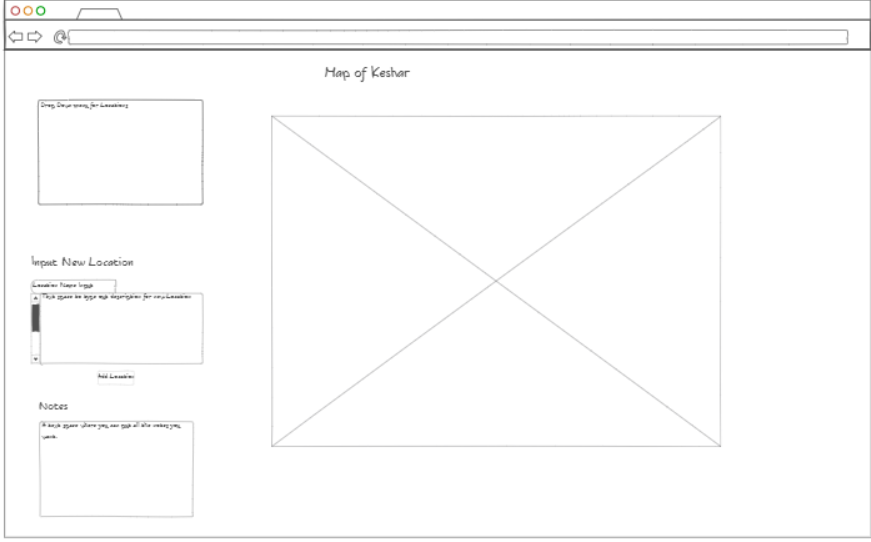

# Startup
Creating a fantasy world can be a daunting task whether it be for a game or for a book or whatever the reasons are. This task can be much more fun when you see your world come to life on a website. With this application you can view a map of a land called Keshar and learn more about cities and locations on the map. You can also add your own new entries into the database.
# Key Features
- Large map of Keshar
- Drop-down menu of different places to learn about
- Descriptions and pictures detailing different locations
- Input available to add locations to the database
- Notes available

# Connection Information
- SSH: ssh -i [key pair file path] ubuntu@3.19.116.52
- NOTE: when using key pair file, store the key in the root directory of the WSL linux file system. Only there can you use chmod
- Elastic public ip: 3.19.116.52
- Domain Name: 260startupapp.click

# Things Learned From Simon HTML Section
- When CSS is not available, HTML can be styled using old HTML tags such as: `
` and ` `
- Fivicons can be added to an HTML document without the use of CSS
- Default language can be applied at the beginning of an HTML document
- SVG can be used to make fairly complex designs
- Endpoint for simon game is simon.260startupapp.click

# Things Learned From Simon CSS Section
- Link to bootstrap framework like this: `<link
      href="https://cdn.jsdelivr.net/npm/bootstrap@5.2.2/dist/css/bootstrap.min.css"
      rel="stylesheet"
      integrity="sha384-Zenh87qX5JnK2Jl0vWa8Ck2rdkQ2Bzep5IDxbcnCeuOxjzrPF/et3URy9Bv1WTRi"
      crossorigin="anonymous"
    />`
- Link to style sheet like this: `<link rel="stylesheet" href="main.css" />`

# Things learned from the HTML and CSS startup deliverable
- drop-down menus can be created by using the element `<select>`
- multiple options can be added to a dropdown menu by using the element `<option>`

# Lessons
https://github.com/webprogramming260/.github/blob/main/profile/instructionTopics.md

# Things learned from the Simon JS Section
- Access HTML elements through the DOM
- It is easy to access HTML elements if you have given them a specific id or class

# Things learned from the Startup JS Section
- You can make switch case functions with this syntax:
  `
  switch(inValue) {
        case "select":
          infoStr = "";
          break;
          default:
          console.log("Invalid Input")
          break;
      }
      `
 - Use .innerHTML after your dom object call to set the HTML of an element by it's id.
 - You must add your <script> tags at the bottom of your HTML documents
