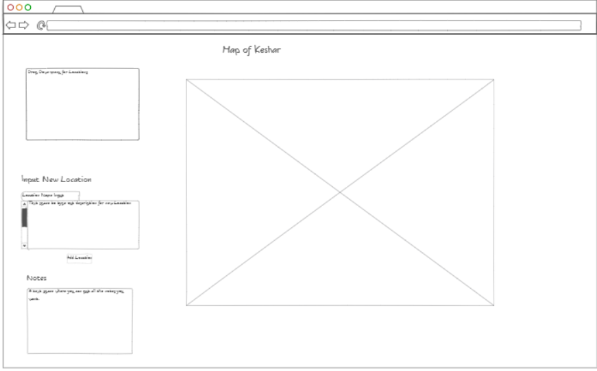

# Startup
Keeping track of your Minecraft resources can be tiresome and confusing. Resources stored in your chests in game can only be viewed one chest at a time and it is difficult to know exactly what resources you have available to you when planning out something to build. With this new application you will be able to track every resource you have and view them all in one application. This will greatly decrease confusing and unnecessary planning time when playing Minecraft.
# Key Features
- Input field for new resource
- Search bar for input new resource field
- List of project/build ideas
- List of all resources
- List of just blocks
- List of just items
- Search bar for resource database

# Connection Information
- SSH: ssh -i [key pair file path] ubuntu@3.19.116.52
- NOTE: when using key pair file, store the key in the root directory of the WSL linux file system. Only there can you use chmod
- Elastic public ip: 3.19.116.52
- Domain Name: 260startupapp.click

# Things Learned From Simon HTML Section
- When CSS is not available, HTML can be styled using old HTML tags such as: `
` and ` `
- Fivicons can be added to an HTML document without the use of CSS
- Default language can be applied at the beginning of an HTML document
- SVG can be used to make fairly complex designs
- Endpoint for simon game is simon.260startupapp.click

# Things Learned From Simon CSS Section
- Link to bootstrap framework like this: `<link
      href="https://cdn.jsdelivr.net/npm/bootstrap@5.2.2/dist/css/bootstrap.min.css"
      rel="stylesheet"
      integrity="sha384-Zenh87qX5JnK2Jl0vWa8Ck2rdkQ2Bzep5IDxbcnCeuOxjzrPF/et3URy9Bv1WTRi"
      crossorigin="anonymous"
    />`
